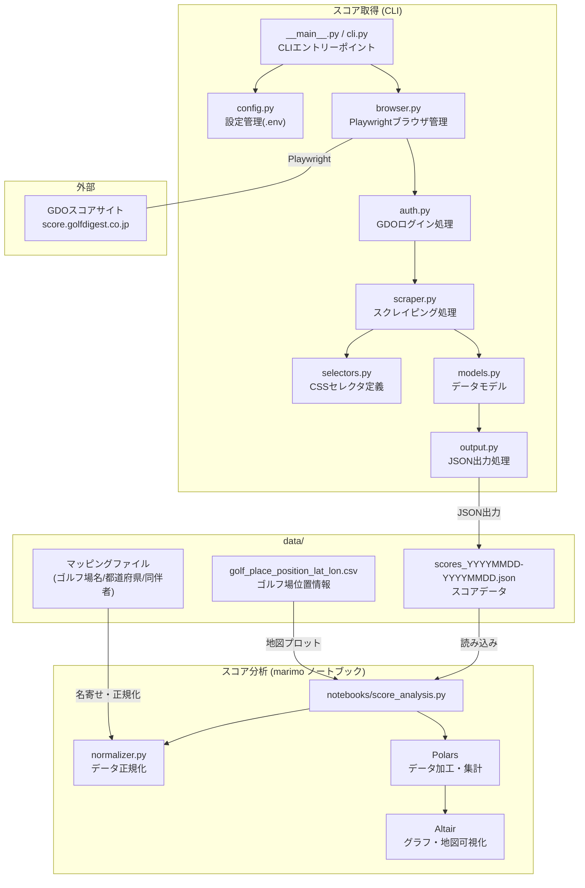

# GDO スコア取得ツール 設計書

## 1. 概要

[GDOスコアサイト](https://score.golfdigest.co.jp/)からゴルフスコア情報を自動取得し、JSON形式で保存するツール。

### 1.1 主要技術スタック

| 項目 | 技術 |
| :---: | :---: |
| 言語 | Python 3.14 |
| ブラウザ自動化 | Playwright |
| パッケージ管理 | uv |
| リンター/フォーマッター | Ruff |
| 型チェック | ty |
| Git hooks | pre-commit |

---

## 2. プロジェクト構造

```text
get-gdo-score/
├── pyproject.toml              # プロジェクト設定・依存関係
├── uv.lock                     # uvのロックファイル
├── .env.example                # 環境変数のサンプル
├── .env                        # 環境変数（.gitignore対象）
├── .pre-commit-config.yaml     # pre-commit設定
├── README.md                   # プロジェクト説明・使い方
├── docs/
│   ├── DESIGN.md               # 設計ドキュメント（本ファイル）
│   └── DEBUGGING.md            # デバッグ・トラブルシューティングガイド
├── src/
│   └── gdo_score/
│       ├── __init__.py
│       ├── __main__.py         # エントリーポイント（CLIコマンド）
│       ├── config.py           # 設定管理（環境変数読み込み）
│       ├── browser.py          # Playwrightブラウザ管理
│       ├── auth.py             # GDOログイン処理
│       ├── scraper.py          # スコアページのスクレイピング
│       ├── selectors.py        # CSSセレクタ定義（一元管理）
│       ├── models.py           # データモデル（Pydantic/dataclass）
│       └── output.py           # JSON出力処理
├── tests/
│   ├── __init__.py
│   ├── conftest.py             # pytestフィクスチャ
│   ├── test_scraper.py         # スクレイパーのテスト
│   └── test_models.py          # モデルのテスト
├── output/                     # 出力JSONファイル保存先
├── debug/                      # デバッグ用ファイル保存先
│   ├── screenshots/            # スクリーンショット
│   ├── traces/                 # Playwrightトレース
│   └── html/                   # ページHTML保存
└── sample/                     # 既存の参考コード（読み取り専用）
```

---

## 3. システム全体像

以下の図は、スコア取得（データ収集）とスコア分析（可視化）の仕組み、およびデータの流れを示しています。



**データの流れ**:

1. **スコア取得**: CLI実行 → Playwrightでブラウザ起動 → GDOサイトにログイン → スコアページをスクレイピング → JSON形式で `data/` に保存
2. **スコア分析**: marimoノートブックが `data/` のJSONを読み込み → `normalizer.py` でゴルフ場名・都道府県を正規化 → Polarsで集計 → Altairで可視化（スコア推移、箱ひげ図、地図など）
3. **共有データ**: `data/` ディレクトリがスコア取得と分析の接点。マッピングファイルは名寄せに、位置情報CSVは地図プロットに使用

---

## 4. モジュール設計

### 4.1 config.py - 設定管理

**責務**: 環境変数からの設定読み込み、設定値のバリデーション

```python
from pydantic_settings import BaseSettings

class Settings(BaseSettings):
    gdo_login_id: str
    gdo_password: str
    output_dir: str = "output"
    debug_mode: bool = False
    headless: bool = True

    class Config:
        env_file = ".env"
```

**設計ポイント**:

- `pydantic-settings`を使用して型安全な設定管理
- `.env`ファイルから認証情報を読み込み（ハードコード禁止）
- デバッグモードフラグで詳細ログやスクリーンショット取得を制御

### 4.2 selectors.py - セレクタ一元管理

**責務**: CSSセレクタの定義と管理

```python
from dataclasses import dataclass

@dataclass(frozen=True)
class Selectors:
    """GDOスコアページのCSSセレクタ定義"""

    # ログインページ
    LOGIN_BUTTON: str = "a.button--login"
    USERNAME_INPUT: str = "input[name='username']"
    PASSWORD_INPUT: str = "input[name='password']"
    SUBMIT_BUTTON: str = ".parts_submit_btn input[type='image']"

    # スコア詳細ページ
    DATE: str = ".score__detail__place__info > p"
    GOLF_PLACE_NAME: str = ".score__detail__place__info > a"
    GOLF_PLACE_NAME_ALT: str = ".score__detail__place__info > div"
    WEATHER: str = ".score__detail__place__info__list__item.is-weather"
    # ... 他のセレクタ
```

**設計ポイント**:

- セレクタを一箇所に集約し、ページ変更時の修正を容易に
- `frozen=True`で不変性を保証
- 代替セレクタ（`_ALT`）を用意してページ構造の変化に対応

### 4.3 browser.py - ブラウザ管理

**責務**: Playwrightブラウザのライフサイクル管理

```python
from contextlib import contextmanager
from playwright.sync_api import sync_playwright, Browser, Page

@contextmanager
def create_browser(headless: bool = True, debug_mode: bool = False):
    """ブラウザインスタンスを生成するコンテキストマネージャ"""
    with sync_playwright() as p:
        browser = p.chromium.launch(headless=headless)
        context = browser.new_context(
            viewport={"width": 1280, "height": 720},
            user_agent="Mozilla/5.0 ..."
        )
        if debug_mode:
            context.tracing.start(screenshots=True, snapshots=True)

        page = context.new_page()
        try:
            yield page
        finally:
            if debug_mode:
                context.tracing.stop(path="debug/traces/trace.zip")
            browser.close()
```

**設計ポイント**:

- コンテキストマネージャでリソースの確実な解放
- デバッグモード時のトレース記録
- User-Agentの設定でbot検知を回避

### 4.4 auth.py - 認証処理

**責務**: GDOサイトへのログイン処理

```python
from playwright.sync_api import Page
from .selectors import Selectors
from .config import Settings

def login(page: Page, settings: Settings) -> bool:
    """GDOサイトにログインする"""
    page.goto("https://score.golfdigest.co.jp/")

    # モーダルが表示された場合は閉じる
    _close_modal_if_exists(page)

    # ログインボタンをクリック
    page.click(Selectors.LOGIN_BUTTON)

    # 認証情報入力
    page.fill(Selectors.USERNAME_INPUT, settings.gdo_login_id)
    page.fill(Selectors.PASSWORD_INPUT, settings.gdo_password)
    page.click(Selectors.SUBMIT_BUTTON)

    # ログイン成功確認
    return _verify_login(page)
```

**設計ポイント**:

- ログイン処理の独立モジュール化
- モーダル対応など、ページ状態の変化に対応
- ログイン成功/失敗の明確な戻り値

### 4.5 scraper.py - スクレイピング処理

**責務**: スコアページからのデータ抽出

```python
from playwright.sync_api import Page
from .models import ScoreData
from .selectors import Selectors

class ScoreScraper:
    """スコアページからデータを抽出するクラス"""

    def __init__(self, page: Page, debug_mode: bool = False):
        self.page = page
        self.debug_mode = debug_mode

    def scrape_all_scores(self, target_years: list[int] | None = None) -> list[ScoreData]:
        """すべてのスコアを取得

        Args:
            target_years: 取得対象年のリスト。Noneの場合は全年取得。

        Returns:
            取得したスコアデータのリスト
        """
        scores = []
        page_num = 1
        older_year_count = 0  # 対象年より古いスコアの連続カウント

        while True:
            url = f"https://score.golfdigest.co.jp/member/score_detail.asp?pg={page_num}"
            self.page.goto(url)

            if not self._has_score_data():
                break

            score = self._extract_score_data()

            # 年フィルタリング
            if target_years is not None:
                score_year = int(score.year)
                min_target_year = min(target_years)

                if score_year in target_years:
                    scores.append(score)
                    older_year_count = 0  # リセット
                elif score_year < min_target_year:
                    older_year_count += 1
                    if older_year_count >= 10:
                        # 10件連続で対象年より古い場合は終了
                        break
                # score_year > max(target_years)の場合はスキップ（カウントせず）
            else:
                scores.append(score)

            page_num += 1

        return scores

    def _extract_score_data(self) -> ScoreData:
        """1ページからスコアデータを抽出"""
        return ScoreData(
            year=self._get_text(Selectors.DATE)[:4],
            month=self._get_text(Selectors.DATE)[5:7],
            day=self._get_text(Selectors.DATE)[8:10],
            golf_place_name=self._get_golf_place_name(),
            # ... 他のフィールド
        )

    def _get_text(self, selector: str, timeout: int = 5000) -> str:
        """セレクタからテキストを取得（エラーハンドリング付き）"""
        try:
            element = self.page.wait_for_selector(selector, timeout=timeout)
            return element.inner_text() if element else ""
        except Exception as e:
            self._save_debug_info(f"failed_selector_{selector}")
            raise
```

**設計ポイント**:

- クラスベースで状態管理を明確に
- 各抽出処理を小さなメソッドに分割
- エラー発生時のデバッグ情報自動保存
- **年指定フィルタリング**: 複数年指定可能（カンマ区切り）
- **効率的なページング**: GDOのデータが新しい順に並んでいることを利用し、10件連続で対象年より古いスコアが見つかった場合に終了

### 4.6 models.py - データモデル

**責務**: スコアデータの型定義とバリデーション

```python
from dataclasses import dataclass, field, asdict
from typing import List

@dataclass
class ScoreData:
    """1ラウンドのスコアデータ"""
    year: str
    month: str
    day: str
    golf_place_name: str
    course_former_half: str
    course_latter_half: str
    prefecture: str
    weather: str
    wind: str
    green: str
    tee: str
    hall_scores: List[str] = field(default_factory=list)
    putt_scores: List[str] = field(default_factory=list)
    teeshots: List[str] = field(default_factory=list)
    fairway_keeps: List[str] = field(default_factory=list)
    oneons: List[str] = field(default_factory=list)
    obs: List[str] = field(default_factory=list)
    bunkers: List[str] = field(default_factory=list)
    penaltys: List[str] = field(default_factory=list)
    accompany_member_names: List[str] = field(default_factory=list)
    accompany_member_scores: List[List[str]] = field(default_factory=list)

    def to_dict(self) -> dict:
        """辞書形式に変換（JSON出力用）"""
        return asdict(self)
```

**設計ポイント**:

- 既存のJSONフォーマットとの完全互換性を維持
- `dataclass`で明確な型定義
- `to_dict()`でJSON変換を簡潔に

### 4.7 output.py - 出力処理

**責務**: JSON形式でのファイル出力

```python
import json
from datetime import datetime
from pathlib import Path
from typing import List
from .models import ScoreData

def save_scores_to_json(
    scores: List[ScoreData],
    output_dir: str = "output"
) -> Path:
    """スコアデータをJSONファイルに保存"""
    output_path = Path(output_dir)
    output_path.mkdir(parents=True, exist_ok=True)

    timestamp = datetime.now().strftime("%Y%m%d%H%M%S")
    filename = output_path / f"scores_{timestamp}.json"

    data = [score.to_dict() for score in scores]

    with open(filename, "w", encoding="utf-8") as f:
        json.dump(data, f, ensure_ascii=False, indent=2)

    return filename
```

### 4.8 **main**.py - CLIエントリーポイント

**責務**: コマンドライン実行のエントリーポイント

```python
import argparse
import logging
from .config import Settings
from .browser import create_browser
from .auth import login
from .scraper import ScoreScraper
from .output import save_scores_to_json

def main():
    parser = argparse.ArgumentParser(description="GDOスコア取得ツール")
    parser.add_argument("--debug", action="store_true", help="デバッグモードを有効化")
    parser.add_argument("--no-headless", action="store_true", help="ブラウザを表示")
    args = parser.parse_args()

    settings = Settings()

    with create_browser(
        headless=not args.no_headless,
        debug_mode=args.debug
    ) as page:
        if not login(page, settings):
            logging.error("ログインに失敗しました")
            return 1

        scraper = ScoreScraper(page, debug_mode=args.debug)
        scores = scraper.scrape_all_scores()

        output_file = save_scores_to_json(scores, settings.output_dir)
        logging.info(f"保存完了: {output_file}")

    return 0

if __name__ == "__main__":
    exit(main())
```

---

## 5. デバッグ・保守性戦略

### 5.1 Playwrightデバッグ機能の活用

| 機能 | 用途 | 使い方 |
| ------ | ------ | -------- |
| **トレース** | 操作履歴の記録・再生 | `context.tracing.start()` |
| **スクリーンショット** | エラー時の画面保存 | `page.screenshot()` |
| **HTML保存** | ページ構造の保存 | `page.content()` |
| **Codegen** | セレクタの自動生成 | `playwright codegen URL` |
| **Inspector** | ステップ実行 | `PWDEBUG=1 python ...` |

### 5.2 自動デバッグ情報収集

```python
def _save_debug_info(self, context: str) -> None:
    """デバッグ情報を自動保存"""
    if not self.debug_mode:
        return

    timestamp = datetime.now().strftime("%Y%m%d_%H%M%S")

    # スクリーンショット
    self.page.screenshot(
        path=f"debug/screenshots/{context}_{timestamp}.png"
    )

    # HTML保存
    with open(f"debug/html/{context}_{timestamp}.html", "w") as f:
        f.write(self.page.content())
```

### 5.3 セレクタ自動修復支援

```python
# selectors.py に代替セレクタパターンを定義
SELECTOR_FALLBACKS = {
    "date": [
        ".score__detail__place__info > p",
        "[data-testid='play-date']",
        ".play-date",
    ],
    "golf_place_name": [
        ".score__detail__place__info > a",
        ".score__detail__place__info > div",
        "[data-testid='golf-course-name']",
    ],
}

def get_element_with_fallback(page: Page, selector_key: str):
    """フォールバックセレクタを順に試す"""
    for selector in SELECTOR_FALLBACKS.get(selector_key, []):
        try:
            element = page.query_selector(selector)
            if element:
                return element
        except:
            continue
    return None
```

---

## 6. エラーハンドリング

### 6.1 カスタム例外

```python
class GdoScoreError(Exception):
    """GDOスコア取得ツールの基底例外"""
    pass

class LoginError(GdoScoreError):
    """ログイン失敗"""
    pass

class SelectorNotFoundError(GdoScoreError):
    """セレクタが見つからない"""
    def __init__(self, selector: str, page_url: str):
        self.selector = selector
        self.page_url = page_url
        super().__init__(f"セレクタ '{selector}' が見つかりません: {page_url}")

class ScrapingError(GdoScoreError):
    """スクレイピング処理エラー"""
    pass
```

### 6.2 リトライ機構

```python
from tenacity import retry, stop_after_attempt, wait_exponential

@retry(
    stop=stop_after_attempt(3),
    wait=wait_exponential(multiplier=1, min=2, max=10)
)
def fetch_score_page(page: Page, page_num: int) -> None:
    """スコアページを取得（リトライ付き）"""
    page.goto(f"https://score.golfdigest.co.jp/member/score_detail.asp?pg={page_num}")
    page.wait_for_load_state("networkidle")
```

---

## 7. テスト戦略

### 7.1 テストの種類

| 種類 | 対象 | 実行タイミング |
| ------ | ------ | ---------------- |
| ユニットテスト | models, output | pre-commit |
| 統合テスト | scraper（モック使用） | CI |
| E2Eテスト | 全体フロー | 手動/定期 |

### 7.2 モックを使用したスクレイパーテスト

```python
# tests/test_scraper.py
import pytest
from unittest.mock import Mock, patch
from gdo_score.scraper import ScoreScraper

@pytest.fixture
def mock_page():
    """Playwrightのページオブジェクトのモック"""
    page = Mock()
    page.wait_for_selector.return_value.inner_text.return_value = "2025/04/28"
    return page

def test_extract_date(mock_page):
    scraper = ScoreScraper(mock_page)
    # テスト実装
```

---

## 8. 依存パッケージ

### 8.1 本番依存

```toml
[project]
dependencies = [
    "playwright>=1.57.0",
    "pydantic>=2.10.0",
    "pydantic-settings>=2.12.0",
    "tenacity>=9.1.0",
]
```

### 8.2 開発依存

```toml
[dependency-groups]
dev = [
    "pytest>=9.0.0",
    "pytest-playwright>=0.7.0",
    "ruff>=0.14.0",
    "ty>=0.0.13",
    "pre-commit>=4.5.0",
]
```

---

## 9. 実装計画

### フェーズ1: 基盤構築 ✅

1. [x] pyproject.toml作成
2. [x] プロジェクト構造作成
3. [x] pre-commit設定
4. [x] 基本的なモジュール（config, models）

### フェーズ2: コア機能 ✅

5. [x] browser.py実装
6. [x] auth.py実装
7. [x] selectors.py定義
8. [x] scraper.py実装

### フェーズ3: 出力・CLI ✅

9. [x] output.py実装
10. [x] **main**.py実装
11. [x] README.md更新

### フェーズ4: 品質向上 🚧

12. [x] ユニットテスト作成（test_models.py, test_output.py, test_config.py）
13. [x] デバッグガイド作成（DEBUGGING.md）
14. [ ] E2Eテスト検討

### フェーズ5: 機能拡張 ✅

15. [x] CLIに年指定フィルタリング機能追加（`--year`オプション、複数年対応）
16. [x] marimoノートブックに複数JSONファイル選択機能追加
17. [x] ノートブックでのデータ統合と重複除外機能

---

## 10. 拡張機能

### 10.1 年指定フィルタリング

**機能**: CLI実行時に特定の年のデータのみを取得

```bash
# 単一年
uv run gdo-score --year 2024

# 複数年（カンマ区切り）
uv run gdo-score --year 2025,2024
```

**実装詳細**:

- `scraper.scrape_all_scores()`が`target_years: list[int] | None`を受け取る
- GDOデータは新しい順に並んでいるため、10件連続で対象年より古いスコアが見つかった時点で取得終了
- 対象年より新しいスコアはスキップ（カウントしない）

### 10.2 ノートブックの複数ファイル対応

**機能**: `data/`ディレクトリ内の複数JSONファイルを選択して統合分析

**実装詳細**:

- `mo.ui.multiselect`で複数ファイル選択
- `pl.concat()`で垂直結合（`how="vertical_relaxed"`）
- 重複レコード除外: `year`, `month`, `day`, `golf_place_name`の組み合わせで`unique()`
- デフォルトで`scores_`で始まる最新ファイルを自動選択（`.bak`は除外）

---

## 11. 参考資料

- [Playwright Python公式ドキュメント](https://playwright.dev/python/)
- [Pydantic Settings](https://docs.pydantic.dev/latest/concepts/pydantic_settings/)
- [Ruff Rules](https://docs.astral.sh/ruff/rules/)
- [Polars DataFrame API](https://pola-rs.github.io/polars/py-polars/html/reference/dataframe/index.html)
- [Marimo Documentation](https://docs.marimo.io/)
